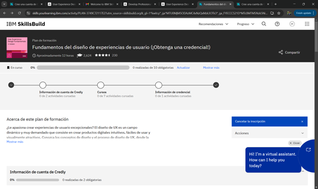
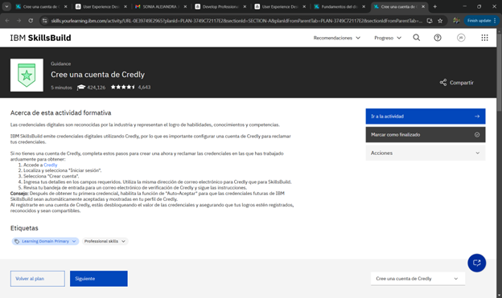
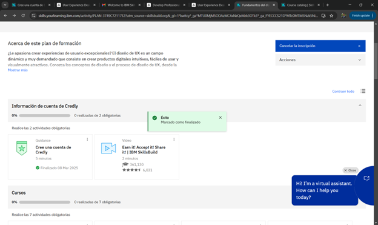
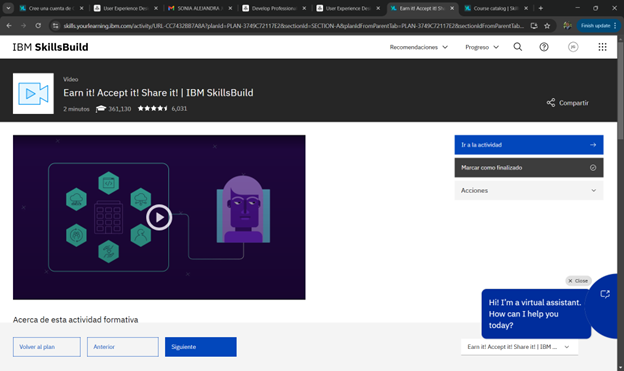
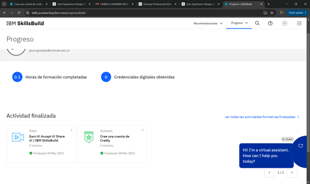
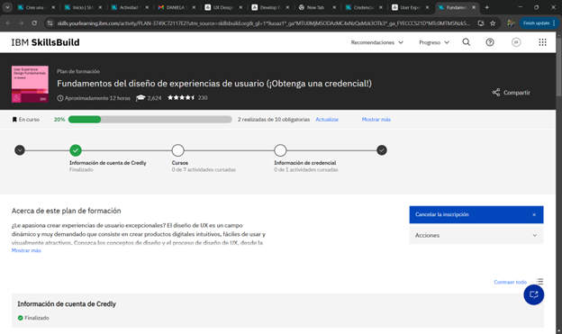

# Actividad 1: Registro y Desarrollo del Curso en IBM SkillsBuild

## Objetivo  
El estudiante deberá registrarse en la plataforma IBM SkillsBuild, completar el plan de formación *"Fundamentos del diseño de experiencias de usuario"*, y documentar la evidencia del proceso en un repositorio de Git siguiendo la estructura indicada.  

## Instrucciones  

### 1. Registro en IBM SkillsBuild  
- Acceder a la plataforma [IBM SkillsBuild](https://skills.yourlearning.ibm.com/) y crear una cuenta o iniciar sesión.  
  
- Inscribirse en el curso *"Fundamentos del diseño de experiencias de usuario (¡Obtenga una credencial!)"*.  
  
- Familiarizarse con el contenido del curso y su estructura.  
  

### 2. Desarrollo del Curso  
- Completar cada una de las 7 actividades de los cursos dentro del plan de formación.  
  
- Guardar los certificados o evidencias de finalización de cada módulo.  
  
- Iniciar el curso y seguir las instrucciones proporcionadas.  
  

### 3. Gestión en el Repositorio Git  
- En el repositorio de trabajo, crear una nueva rama con el nombre:  

  ```bash
  git checkout -b feature/certification
  ```  

- Dentro de esta rama, crear una carpeta con la siguiente estructura:  

  ```
  01-user-experience-design/
  ```

- Dentro de esta carpeta, almacenar las evidencias de cada actividad completada en el curso, asegurándose de incluir:  
  - Capturas de pantalla o certificados de finalización de cada uno de los módulos.  
  - Modelos o documentación generada durante el curso.  

### 4. Registro de Evidencias en Git  
- Realizar *commits* periódicos reflejando cada avance en el curso.  
- Utilizar mensajes de *commit* descriptivos, por ejemplo:  

  ```bash
  git commit -m "Added certificate for UX Fundamentals - Module 1"
  ```  

- Hacer *push* de la rama al repositorio remoto para evidenciar la realización de la actividad:  

  ```bash
  git push origin feature/certification
  ```  

## Curso de Diseño de Experiencias de Usuario

Para más información sobre el curso de diseño de experiencias de usuario, puede visitar el siguiente enlace:  
[User Experience Design en IBM SkillsBuild](https://skillsbuild.org/adult-learners/explore-learning/user-experience-design) => https://skillsbuild.org/adult-learners/explore-learning/user-experience-design

## Entrega y Evaluación  
- El profesor revisará el repositorio para validar que la rama `feature/certification` contiene la estructura correcta y las evidencias del proceso de formación.  
- Se verificará que cada una de las actividades del curso tenga su respectivo soporte en la carpeta `01-user-experience-design/`.  
- La actividad será aprobada si el Git refleja claramente la ejecución del curso con las evidencias de modelado y desarrollo.
